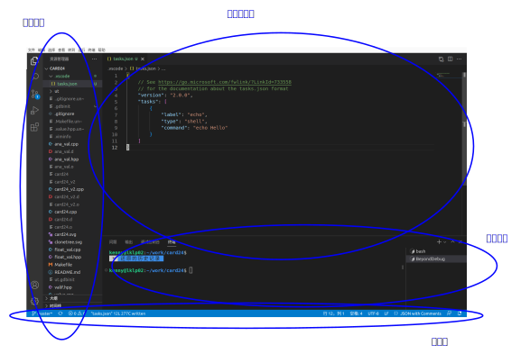

  .. Kenneth Lee 版权所有 2022

:Authors: Kenneth Lee
:Version: 0.1
:Date: 2022-08-27
:Status: Draft

开发环境
*********

正文
====

正如上一章说的，C++是一门“语言”，学一门语言最简单的方法就是用。一句话一句话学怎
么讲，然后练习什么“自我介绍”啦，什么旅游心得啦，慢慢就学会了。

计算机语言也是一样的，随便找本书，把上面的例子全部敲到计算机里面，都试一下，用
多了，就会了。这东西比英语容易学，因为计算机的语言实在是太贫瘠了。而且你学会一种
语言以后，其他的语言都是大同小异的，类比一下也就知道了，不外乎就是函数调用，判断，
循环，跳转这么几个套路。那个东西不需要我额外教。

但写一个C或者C++的程序需要用编译器编译，而且要找一个平台运行看看计算机给你的结
果是什么，所以我这里重点讲一下怎么建立一个这样的工作环境，以便你可以把那些例子
敲进去，试试结果是怎么样的。

所以，这一章开始，你就需要拿出计算机来，对着这里的方法，一个个试过去了。

每种计算机都会提供自己的汇编和C编译环境的，每个都有有点区别。很多时候我们会把时
间浪费在怎么用这些环境上。我的建议是先熟悉其中一种，其他都是大同小异，到时候类比
就可以了。

这些环境有些会像Office一样，一开始打开一个大程序，然后给你一个窗口，你好像写
Word文档一样，把程序敲进去，然后在菜单中找到“run”这个菜单，敲一下，你就看到运行
的结果了。你让我教，我不会从这样的环境入门，因为这样自动化的东西太多了，你弄完
都是一脸懵逼，不知道自己搞了些啥，这种经验也不利于你把经验推广到其他语言和环境
上。

所以我建议你使用Windows上的Linux运行环境，你现在机器上已经安装这个了，你联网后，
先用：::

  sudo apt install g++
  sudo apt install gdb      <--- 这是调试器，先装上，我们以后说怎么用

安装C++编译器。这个g++是gnu c++ toolchain的简称。GNU是一个开源组织，它的开发工
具都是免费的，代码也是开放的，用惯以后，以后你学习编译器原理的时候，可以直接看
它的代码，看看你感受到的功能，是怎么用C语言实现出来的。

g++是一个toolchain，不仅仅是编译器。我们上一章说了，你写了C++的程序，需要编译器
翻译成汇编程序，再把汇编程序汇编成二进制。所以，安装g++，你得到的不仅仅是一个编
译器，你同时还安装了全套的工具，比如：

1. 汇编器，这叫as，它的用途你已经知道了
2. 编译器，这叫ccl，这是我们说的编译器
3. 预编译器，这叫cpp，这是编译之前对你写的代码的预出来的一个工具，这个等你学宏
   和头文件的时候会知道的
4. 链接器，这个用于把你多个代码文件合并成一个的工具。
5. 其他配套工具，比如反汇编用的objdump等等，调试用的gdb等等。

而g++是一个组合器，你不需要一个个运行前面的程序（但你可以），g++会一次把这种工
作组合在一起来做的。

如果你要写程序，比如你写了两个文件：::

  my_application.cc     # 主程序
  my_functions.cc       # 单独的函数

C++的程序都是文本文件，扩展名通常叫cc或者cpp，你可以用vim一个个敲进去，敲完以后，用
这个命令进行处理：::

  g++ -Wall -g my_application.cc my_function.cc -o my_app

带-的都是g++的控制参数，其中-Wall, -g都可以不写。-Wall表示Warning All，就是把所
有有可能写错的地方都提示出来。-g表示这个程序是准备调试的（这本来应该叫-d才对，
debug嘛，但-d被其他功能用了，就只好换成-g了），程序里面会生成很多调试采用的信息
，如果你不调试这个程序就不写这个，这样程序就小一点，快一点。当然，这些都是针对
正规有几万几百万行代码的程序来说的，对于例子程序来说，这些所谓大一点，快一点什
么的，都不值一提。

-o my_app，表示output，表示生成的二进制叫my_app，这样你就会得到一个可以运行的命
令了。直接执行./my_app就可以看看你的输出是什么了。

我们说了，g++其实不是编译器，它是一个组合器，用来把其他命令组合起来，如果你想要知道它怎么组合的，
你可以在命令上加一个-v的参数，这是verbose的简称，你会看到类似这样的结果：::

  Using built-in specs.
  COLLECT_GCC=g++
  COLLECT_LTO_WRAPPER=/usr/lib/gcc/x86_64-linux-gnu/9/lto-wrapper
  OFFLOAD_TARGET_NAMES=nvptx-none:hsa
  OFFLOAD_TARGET_DEFAULT=1
  Target: x86_64-linux-gnu
  Configured with: ../src/configure -v --with-pkgversion='Ubuntu 9.4.0-1ubuntu1~20.04.1' --with-bugurl=file:///usr/share/doc/gcc-9/README.Bugs --enable-languages=c,ada,c++,go,brig,d,fortran,objc,obj-c++,gm2 --prefix=/usr --with-gcc-major-version-only --program-suffix=-9 --program-prefix=x86_64-linux-gnu- --enable-shared --enable-linker-build-id --libexecdir=/usr/lib --without-included-gettext --enable-threads=posix --libdir=/usr/lib --enable-nls --enable-clocale=gnu --enable-libstdcxx-debug --enable-libstdcxx-time=yes --with-default-libstdcxx-abi=new --enable-gnu-unique-object --disable-vtable-verify --enable-plugin --enable-default-pie --with-system-zlib --with-target-system-zlib=auto --enable-objc-gc=auto --enable-multiarch --disable-werror --with-arch-32=i686 --with-abi=m64 --with-multilib-list=m32,m64,mx32 --enable-multilib --with-tune=generic --enable-offload-targets=nvptx-none=/build/gcc-9-Av3uEd/gcc-9-9.4.0/debian/tmp-nvptx/usr,hsa --without-cuda-driver --enable-checking=release --build=x86_64-linux-gnu --host=x86_64-linux-gnu --target=x86_64-linux-gnu
  Thread model: posix
  gcc version 9.4.0 (Ubuntu 9.4.0-1ubuntu1~20.04.1)
  COLLECT_GCC_OPTIONS='-v' '-o' 'my_app' '-shared-libgcc' '-mtune=generic' '-march=x86-64'
   /usr/lib/gcc/x86_64-linux-gnu/9/cc1plus -quiet -v -imultiarch x86_64-linux-gnu -D_GNU_SOURCE my_application.cc -quiet -dumpbase my_application.cc -mtune=generic -march=x86-64 -auxbase my_application -version -fasynchronous-unwind-tables -fstack-protector-strong -Wformat -Wformat-security -fstack-clash-protection -fcf-protection -o /tmp/ccJH4xDU.s
  GNU C++14 (Ubuntu 9.4.0-1ubuntu1~20.04.1) version 9.4.0 (x86_64-linux-gnu)
          compiled by GNU C version 9.4.0, GMP version 6.2.0, MPFR version 4.0.2, MPC version 1.1.0, isl version isl-0.22.1-GMP
  
  GGC heuristics: --param ggc-min-expand=100 --param ggc-min-heapsize=131072
  ignoring duplicate directory "/usr/include/x86_64-linux-gnu/c++/9"
  ignoring nonexistent directory "/usr/local/include/x86_64-linux-gnu"
  ignoring nonexistent directory "/usr/lib/gcc/x86_64-linux-gnu/9/include-fixed"
  ignoring nonexistent directory "/usr/lib/gcc/x86_64-linux-gnu/9/../../../../x86_64-linux-gnu/include"
  #include "..." search starts here:
  #include <...> search starts here:
   /usr/include/c++/9
   /usr/include/x86_64-linux-gnu/c++/9
   /usr/include/c++/9/backward
   /usr/lib/gcc/x86_64-linux-gnu/9/include
   /usr/local/include
   /usr/include/x86_64-linux-gnu
   /usr/include
  End of search list.
  GNU C++14 (Ubuntu 9.4.0-1ubuntu1~20.04.1) version 9.4.0 (x86_64-linux-gnu)
          compiled by GNU C version 9.4.0, GMP version 6.2.0, MPFR version 4.0.2, MPC version 1.1.0, isl version isl-0.22.1-GMP
  
  GGC heuristics: --param ggc-min-expand=100 --param ggc-min-heapsize=131072
  Compiler executable checksum: 65fe925b83d3956b533de4aaba7dace0
  COLLECT_GCC_OPTIONS='-v' '-o' 'my_app' '-shared-libgcc' '-mtune=generic' '-march=x86-64'
   as -v --64 -o /tmp/ccvPxWQT.o /tmp/ccJH4xDU.s
  GNU汇编版本 2.34 (x86_64-linux-gnu) 使用BFD版本 (GNU Binutils for Ubuntu) 2.34
  COLLECT_GCC_OPTIONS='-v' '-o' 'my_app' '-shared-libgcc' '-mtune=generic' '-march=x86-64'
   /usr/lib/gcc/x86_64-linux-gnu/9/cc1plus -quiet -v -imultiarch x86_64-linux-gnu -D_GNU_SOURCE my_functions.cc -quiet -dumpbase my_functions.cc -mtune=generic -march=x86-64 -auxbase my_functions -version -fasynchronous-unwind-tables -fstack-protector-strong -Wformat -Wformat-security -fstack-clash-protection -fcf-protection -o /tmp/ccJH4xDU.s
  GNU C++14 (Ubuntu 9.4.0-1ubuntu1~20.04.1) version 9.4.0 (x86_64-linux-gnu)
          compiled by GNU C version 9.4.0, GMP version 6.2.0, MPFR version 4.0.2, MPC version 1.1.0, isl version isl-0.22.1-GMP
  
  GGC heuristics: --param ggc-min-expand=100 --param ggc-min-heapsize=131072
  ignoring duplicate directory "/usr/include/x86_64-linux-gnu/c++/9"
  ignoring nonexistent directory "/usr/local/include/x86_64-linux-gnu"
  ignoring nonexistent directory "/usr/lib/gcc/x86_64-linux-gnu/9/include-fixed"
  ignoring nonexistent directory "/usr/lib/gcc/x86_64-linux-gnu/9/../../../../x86_64-linux-gnu/include"
  #include "..." search starts here:
  #include <...> search starts here:
   /usr/include/c++/9
   /usr/include/x86_64-linux-gnu/c++/9
   /usr/include/c++/9/backward
   /usr/lib/gcc/x86_64-linux-gnu/9/include
   /usr/local/include
   /usr/include/x86_64-linux-gnu
   /usr/include
  End of search list.
  GNU C++14 (Ubuntu 9.4.0-1ubuntu1~20.04.1) version 9.4.0 (x86_64-linux-gnu)
          compiled by GNU C version 9.4.0, GMP version 6.2.0, MPFR version 4.0.2, MPC version 1.1.0, isl version isl-0.22.1-GMP
  
  GGC heuristics: --param ggc-min-expand=100 --param ggc-min-heapsize=131072
  Compiler executable checksum: 65fe925b83d3956b533de4aaba7dace0
  COLLECT_GCC_OPTIONS='-v' '-o' 'my_app' '-shared-libgcc' '-mtune=generic' '-march=x86-64'
   as -v --64 -o /tmp/ccYEtbWT.o /tmp/ccJH4xDU.s
  GNU汇编版本 2.34 (x86_64-linux-gnu) 使用BFD版本 (GNU Binutils for Ubuntu) 2.34
  COMPILER_PATH=/usr/lib/gcc/x86_64-linux-gnu/9/:/usr/lib/gcc/x86_64-linux-gnu/9/:/usr/lib/gcc/x86_64-linux-gnu/:/usr/lib/gcc/x86_64-linux-gnu/9/:/usr/lib/gcc/x86_64-linux-gnu/
  LIBRARY_PATH=/usr/lib/gcc/x86_64-linux-gnu/9/:/usr/lib/gcc/x86_64-linux-gnu/9/../../../x86_64-linux-gnu/:/usr/lib/gcc/x86_64-linux-gnu/9/../../../../lib/:/lib/x86_64-linux-gnu/:/lib/../lib/:/usr/lib/x86_64-linux-gnu/:/usr/lib/../lib/:/usr/lib/gcc/x86_64-linux-gnu/9/../../../:/lib/:/usr/lib/
  COLLECT_GCC_OPTIONS='-v' '-o' 'my_app' '-shared-libgcc' '-mtune=generic' '-march=x86-64'
   /usr/lib/gcc/x86_64-linux-gnu/9/collect2 -plugin /usr/lib/gcc/x86_64-linux-gnu/9/liblto_plugin.so -plugin-opt=/usr/lib/gcc/x86_64-linux-gnu/9/lto-wrapper -plugin-opt=-fresolution=/tmp/cc6HJe3T.res -plugin-opt=-pass-through=-lgcc_s -plugin-opt=-pass-through=-lgcc -plugin-opt=-pass-through=-lc -plugin-opt=-pass-through=-lgcc_s -plugin-opt=-pass-through=-lgcc --build-id --eh-frame-hdr -m elf_x86_64 --hash-style=gnu --as-needed -dynamic-linker /lib64/ld-linux-x86-64.so.2 -pie -z now -z relro -o my_app /usr/lib/gcc/x86_64-linux-gnu/9/../../../x86_64-linux-gnu/Scrt1.o /usr/lib/gcc/x86_64-linux-gnu/9/../../../x86_64-linux-gnu/crti.o /usr/lib/gcc/x86_64-linux-gnu/9/crtbeginS.o -L/usr/lib/gcc/x86_64-linux-gnu/9 -L/usr/lib/gcc/x86_64-linux-gnu/9/../../../x86_64-linux-gnu -L/usr/lib/gcc/x86_64-linux-gnu/9/../../../../lib -L/lib/x86_64-linux-gnu -L/lib/../lib -L/usr/lib/x86_64-linux-gnu -L/usr/lib/../lib -L/usr/lib/gcc/x86_64-linux-gnu/9/../../.. /tmp/ccvPxWQT.o /tmp/ccYEtbWT.o -lstdc++ -lm -lgcc_s -lgcc -lc -lgcc_s -lgcc /usr/lib/gcc/x86_64-linux-gnu/9/crtendS.o /usr/lib/gcc/x86_64-linux-gnu/9/../../../x86_64-linux-gnu/crtn.o
  COLLECT_GCC_OPTIONS='-v' '-o' 'my_app' '-shared-libgcc' '-mtune=generic' '-march=x86-64'

这是它实际调用的那些命令了和使用的参数了。

先用这种方法建立运行环境，然后看教材的第一部分，跑起来一个程序，然后再看后面的部分。

其他环境
========

Cygwin
------

前面介绍用WSL环境，如果你不和Windows发生什么关系，彻底用它，一般就可以直接当作
一个Linux来用，这一般比较方便。但如果你要用比如DevC++之类的Windows下的IDE（集成
开发环境），它会变得没有那么方便。我这里推荐另一个环境：cygwin。

和WSL不同，WSL是在Windows中模拟一个Linux，WSL里面每个Linux的命令，从二进制开始，
就是一个真实的Linux命令，你把它拷贝到Linux的的操作系统上，它们都是可以直接运行
的。cygwin不一样，cygwin对每个命令都进行了改造，让它直接调用Windows操作系统的功
能，所以，cygwin上的命令只是功能上像一个Linux命令，但其实它们都是实实在在的
Windows程序。所以，它们可以直接在Windows上运行，不需要做特别的转换。

cygwin的主页是这个：
`cygwin <http://www.cygwin.org/>`_
。
安装程序在这里：
`cygwin-setup-x86_64 <http://www.cygwin.org/setup-x86_64.exe>`_
。
它很小，因为这只是一个安装程序，真正要装的Linux命令是要选的。安装过程需要你选择
网络是否需要proxy（如果你不知道proxy是什么，就选Direct连接。前者一般是公司内部
不能直接联网，通过一台代理服务器统一上网的时候用的。），安装路径是你未来所有
Linux程序的位置，用默认的位置就好了（通常是c:\cygwin64)。它还会让你选择下载的安
装包的位置，这是要装的软件还没有拷贝到c:\cygwin64中的临时位置，也用默认的位置就
好了（通常是和安装程序在同一个目录中）。还有一个步骤需要你选择mirrors的位置，这
是为了提高下载的速度，cygwin在全世界都放了这些安装包的镜像，你选一个离你近的，
下载起来速度比较快，国内一般可以选择163.com的镜像。

昨晚上面的准备，就会要求你选择装哪些软件，如果只是要实验一下，也用默认就可以了，
这会安装基本的命令。但如果用来做开发，我建议你再加上如下软件包的选择：

* vim: 这个你知道，编辑器
* tmux: 在一个窗口中开多个命令行
* git：这个后面会讲它的功能的，版本管理工具
* make：这个后面也会讲，工程管理工具
* gcc-core：基本gcc工具
* gcc-g++：g++编译器（默认的gcc编译器只支持C）
* gdb：调试器
* cccc：代码量统计工具

基本上就足够支持你做C/C++的开发了。这些软件包常常有多个版本可以选，我一般会选择
最新的（版本数字最大），但没有说是测试中（后面会标注着“test”）的那些版本。

未来如果你还想加软件或者删除软件，可以重新执行上面的步骤，做不同的选择就可以了。

装完的软件都在c:\cygwin64目录下（如果你前面是这个选择的话），Windows的命令行并
不知道这个路径，所以，需要加上运行程序的路径。

方法是在文件浏览器中找到“此电脑”，点鼠标右键，选择属性，再选择“高级系统设置”，
选择“环境变量”，然后在个人的“PATH”这个设置中，加上c:\cygwin64\bin和
c:\cygwin64\usr\bin这两个目录即可。

其实还可以加上c:\cygwin64\usr\sbin和c:\cygwin\sbin这两个目录的，不过一般你这个
也不是真正的Linux，你只是要用用命令，所以“系统命令”一般不用，多一事不如少一事，
不设置就好。

PATH可以设置多个目录，它们的先后顺序会影响那个目录的命令优先其作用，比如你
cygwin里面有一个gcc，但你的DevC++里面也装了一个gcc，那么你在命令行上不指定路径
直接运行gcc，运行的是谁呢？那就是谁在前面就是谁。我个人一般把cygwin的路径放前面。
（DevC++自己用绝对路径调用gcc，所以你只是使用DevC++，不是要在命令行用它的gcc，
不需要为它设置路径的。）

Linux命令需要使用HOME目录，但Windows是没有这个概念的。所以你还可以加一个环境变
量，叫HOME，指定你的HOME目录的位置，这个随你喜欢怎么放，我个人一般放在Windows的
个人目录中，比如你的用户名叫selina，就把HOME这个环境变量定义成:\Users\selina就
可以了。HOME目录很重要是因为所有Linux命令的配置文件，比如.vimrc，.bashrc，
.gitconfig都是放在那里的，没有这个环境变量，就控制不了这些文件的查找位置。

对了，cygwin的gcc（包括g++）编译的程序，和其他cygwin的程序一样，也是真正的
Windows程序，可以直接在Windows上运行的。

vscode
------

基本介绍
````````

vscode也是一个初学者中比较流行的开发环境，这里也介绍一下，我认为当作一个面向图
形界面的vim来用就好了。

这一章的内容和Makefile，gdb等概念有关，如果你从头开始看这个教程，可以先跳过，等
看完后面的内容，还想装vscode，再回来看。或者你可以不求甚解地浏览一下，心里有个
底，以后觉得想用的时候再深入了解它。

我们把vscode和vim对比，是因为vscode和DevC++不同，后者是一个IDE（集成开发环境），
就是做出来给你开发C++用的。vscode本质上是一个编辑器，只是它可以让你装很多插件，
依靠这些插件来完成部分开发才需要的功能而已。这一点vim也是一样的。

和vim不同的地方是，vs code是以图形界面为设计目标的，而vim是以文本界面为设计目标
的，所以vs code有些时候对初学者是更友好的。而且它比较新，用了不少更先进的基础技
术。但我个人觉得它稳定性和通用行都不如vim，所以，这个阶段你让我选，我首选还是学
习vim，但作为初学者，也许你会考虑优先用vscode。

vscode首先是个编辑器，所以不能用DevC++这样的IDE去要求它。它本身只是让你编辑文件，
而不是让你做编译和调试。这些都不是它的功能。但它允许你装“扩展”去“集成”这样的功
能。甚至你可以通过安装vim扩展让它支持vim那样的编辑模式（但只是编辑部分，vim其实
还有很多其他功能它是支持不了的，比如命令行和vim的编辑集成等。）

作为编辑器，vscode有一个很容易造成误会的高级功能：它不需要你存盘。你打开一个文
件，修改，只要你不存盘，这个内容也不会丢失，它会给你保存在另一个地方（即使退出
程序仍然存在），所以，你不要修改完文件了，就觉得这个文件的内容就修改了，其实它
只是修改了一个“Cache”（缓冲），你还是要主动存盘才能真的修改这个文件。

默认的vscode也不认识C/C++程序，但你可以通过安装C/C++扩展来让它“认识”。安装C/C++
插件后，vscode会按不同颜色显示你的C/C++关键字（这称为“语法高亮”），可以自动发现
你代码中明显的错误，你编辑到函数等地方的时候，它可以自动提示你是否有语法错误。

同理，你要用Python，也可以装Python的语言扩展。

但它不能支持你编译和调试你的程序。vscode也提供了很多别的“扩展”来支持你进行这种
编译和调试，但我用过的体验都不好。所以，这里我的建议是不要装这类插件了，还是老
老实实用make和gdb。但我会告诉你怎么把make和gdb集成进来使用。

为了介绍make和gdb的集成，我们开始理解一下vscode的基础概念（理解一个软件最好从它
的基础概念入手，这样后面的逻辑很容易组合起来，而不需要记好多散碎的“知识点”）。

vscode的程序（命令）就叫code，你可以从（操作系统的）菜单启动它，也可以从（操作
系统的）命令行启动它。启动的时候，可以用文件，也可以用目录作为参数。如果你编辑
一个文件，那么vscode就围绕这一个文件来工作，如果你编辑一个目录，那么vscode就围
绕着这个目录来工作，这个目录就称为一个“工作目录”。vscode的很多工作，都是围绕着
这个工作目录展开的。这一点就好像我们后面介绍make的时候一样。我们写程序完成一个
任务就是一堆文件，把文件放在一起就是一个目录了，我们把这个目录叫做一个“工程”
（Project），换一个目录就是另一个工程。所以，这些工具都以一个目录为中心，这是很
自然的设计。

所以，就算你编辑一个文件，你也可以在vscode里面选择打开一个工作目录，从而围绕着
这个目录来工作。

我在这里放了一个示例性质的工程（用来计算24点游戏的解）：
https://gitee.com/Kenneth-Lee-2012/card24
。你可以参考一下看看一个正规的项目大概会包含哪些东西。

进入code以后，它的界面大概包括这些部分：



其中导航窗口主要是从不同的角度看整个工程的状态，主工作窗口做主要的工作（比如编
辑程序），状态窗口用来做辅助性的工作，而状态栏用于看导航窗口和主工作窗口的状态。

导航窗口旁边的图标主要是不同的导航窗口，你安装更多的插件，常常会增加更多的导航
窗口，但默认一般有这么一些：

* 文件：这用来看工作目录的所有文件
* 查找：这用来看查找结果
* git：这里集成git相关的功能
* 运行和调试：这用来运行和调试程序
* 扩展：这用安装和管理扩展

具体怎么用，我们到谈具体功能的时候再谈。在没有具体功能前，最有用的就是“文件”这
个窗口了，这里当作一个文件浏览器来用，直接可以打开文件。

主工作窗也不用介绍了，主要就是编辑器。vscode的每个编辑器窗口可以包含多个Tab，Tab
互相之间是看不到的，用Ctrl-Tab切换。但窗口是并列在屏幕上的，好处是可以互相可以
对照这看。有时你的文件很大，你可以直接用两个窗口打开同一个文件，一个看前面的变
量定义，一个在后面写代码，这会比较方便。窗口之间用Ctrl-1/2/3...来切换。

基本上，你记住Ctrl-Tab，Ctrl-1/2/3，还有Ctrl-\`用来切换到命令行，你大部分时候都
不需要拿起鼠标了。

状态窗口值得深入说一下，它也有多个窗口，可以选择：

* 问题：就是你打开的文件自动发现的问题，比如你的C++程序语法有错，这里会显示出来。
* 输出：这是你程序用cout这类手段输出结果时显示的内容
* 调试控制台：这用来显示你的调试器的功能，我们后面说
* 终端：这里直接给你模拟了一个命令行终端

这个区域也是可以扩展的，你安装的扩展可能会在这里增加新的选择。

这里问题窗口不用学，你打开就明白它有什么用了（特别是你打开的程序有错的时候）。
输出和调试控制台我们到谈功能的时候再谈。

最值得介绍的是那个“终端”窗口。它就是一个命令行的控制台，就在你的工作目录下，所
以，如果你装了cygwin，在这里随便运行命令就可以了。你要编译，执行make，也没有问
题。有了这个功能，一定程度上说，你用编辑器编辑文件，然后直接在这里做编译，开gdb
做调试，都可以了，其他功能都可以不学。

终端窗口默认使用微软的PowerShell，我个人不喜欢，很多命令和cygwin冲突。上面有个
菜单，可以让你选择其他Shell，我建议选择Windows Command。

.. note::

   vscode完全可以当作一个控制台程序来用的，你甚至可以通过命令
   "Terminal: Create New Terminal in Editor Area"把它启动在主工作区，就在这里
   专心运行命令。

界面的最后一个区域是状态栏，这里显示当前整个程序和当前工作窗口的状态，这个一眼
就看明白了。我重点提醒一句是，文本的中文编码，要在UTF-8和GB18030或者GB2312之间
切换，都可以通过单击这里的编码类型去更改。如果你经常和DevC++一起使用，可以用命
令“打开工作区设置”，然后查找其中的encoding配置项，从UTF-8修改成GB2312。这样两边
的编码就一致了。因为这个配置是针对你这个目录的，也不影响其他项目。

如果你要用集成的编译和调试功能，那就要麻烦一些了。简单说，你要用vscode的语法写
一段代码告诉它怎么做这种编译和调试。vscode确实有很多插件干这种事，但大部分都不
灵活，我不推荐，我建议你用标准的Makefile和GDB方法来做这种集成。

vscode的菜单上可以选择“终端-运行生成任务”来编译程序，也可以选择“运行-启动调试”
来启动一个调试。但作为一个编辑器，vscode既不能编译，也不能调试。所以你需要自己
安装编译器和调试器（比如用我们前面提到的cygwin安装g++和gdb）。有了这些东西，你
至少可以，在“终端”窗口上直接运行编译和调试了。

要让vscode能主动调用这些程序，你需要告诉vscode怎么做这种调用。这就是vscode的“任
务”的概念。每个“任务”，相当于一个脚本，告诉vscode如何执行一些工作。所以执行make，
也是一个任务。

为了让当前的工程知道有什么任务可以执行，需要在工程目录中创建一个.vscode目录，在
里面放一个tasks.json文件，在里面定义你要执行的任务。

.. note::

  顺口说一句，vscode是用node.js写的（Java Script），Java Script的标准数据描述形式
  就是.json，所以你看到的各种vscode的配置，几乎都是.json的。这也是个文本文件，格式
  其实非常简单，主要就是描述“名字:内容”这样的数据结构的，你多看几次大概就知道它
  的规律了。vscode说到底就是通过这个文件问你：你给我的数据到底是什么，那些名字
  告诉它具体是那个数据。

比如你要创建一个make的编译（vscode叫“生成”）任务，你可以选择菜单“终端-配置默认
生成任务”，它就会自动给你生成这个文件，内容是这样的：::

  {
        "version": "2.0.0",
        "tasks": [
                {
                        "label": "echo",
                        "type": "shell",
                        "command": "echo Hello"
                }
        ]
  }

这是一个样例，没有什么用的。你都可以猜到，它就是执行了"echo Hello"这个命令而已。
但有了它，现在你可以选择“终端-运行生成任务”（或者Ctrl-Shift-B）来编译程序，因为
少了不少东西，启动的时候它会问你一些问题，帮你补上一些选项，最后运行的是这样
的：::

  {
      // See https://go.microsoft.com/fwlink/?LinkId=733558
      // for the documentation about the tasks.json format
      "version": "2.0.0",
      "tasks": [
          {
              "label": "echo",
              "type": "shell",
              "command": "echo Hello",
              "problemMatcher": [
                  "$gcc"
              ],
              "group": {
                  "kind": "build",
                  "isDefault": true
              }
          }
      ]
  }

然后你就要看里面提到的这个文档（就是那个“https://go.microsoft.com/fwlink/?LinkId=733558”），
学会有些什么参数了。但大部分时候写成这样就可以了：::

  {
      "version": "2.0.0",                               // 这个靠自动生成，为了给vscode看到用什么格式而已
      "tasks": [                                        // 所有任务的定义
          {                                             // 第一个任务
              "label": "make",                          // 任务的名字
              "type": "shell",                          // 任务的类型，运行shell命令就叫shell
              "command": "make",                        // 具体运行什么命令做编译          
              "problemMatcher": [                       // 出错信息用什么方法做匹配
                  "$gcc"                                // 我们的错误是gcc输出的，所以用gcc
              ],
              "group": {                                // 任务属于什么组
                  "kind": "build",                      // 我们这个是用来编译的，所以是build
                  "isDefault": true                     // 是不是默认的build任务
              }
          }
      ]
  }

vscode可以自动联想，所以如果你不知道应该选什么，可以从冒号开始重新敲一次，让它
告诉你可以取什么值。（联想有热键可以激活的，默认是Ctrl空格，刚好和中文输入法冲
突了，你可以在配置里面修改一下。如果你了vim的扩展，这个地方的热键变成Ctrl-P了，
反而不会有问题。）

如果你要更多的任务，可以继续加，比如你可以加一个make clean：::

  {
      "version": "2.0.0",                               // 这个靠自动生成，为了给vscode看到用什么格式而已
      "tasks": [                                        // 所有任务的定义
          {                                             // 第一个任务
              "label": "make",                          // 任务的名字
              "type": "shell",                          // 任务的类型，运行shell命令就叫shell
              "command": "make",                        // 具体运行什么命令做编译          
              "problemMatcher": [                       // 出错信息用什么方法做匹配
                  "$gcc"                                // 我们的错误是gcc输出的，所以用gcc
              ],
              "group": {                                // 任务属于什么组
                  "kind": "build",                      // 我们这个是用来编译的，所以是build
                  "isDefault": true                     // 是不是默认的build任务
              }
          },                                            // 记得这里有个逗号，和下一个任务隔开
          {                                             // 第二个任务
              "label": "clean",                         // 任务的名字
              "type": "shell",                          // 同上
              "command": "make",                        // 具体运行什么命令做编译          
              "args" : ["clean"],                       // 这次我们要带参数，组成make clean（其实你不行这个，直接在command里面写make clean也是可以的）
              "problemMatcher": [],                     // clean不需要match什么东西
              "group": {                                // 任务属于什么组
                  "kind": "build",                      // 这也是一个build命令
                  "isDefault": false                    // 但这个不是默认的（按"Ctrl-Shift-B"不会选择它）
              }
          }
      ]
  }

这样编译以后，你就可以在问题状态窗口中看到编译错误了。由于都是调用make，上面这
个文件你可以直接拷贝下来，直接拷贝到每个工程下面直接用。其实那些“扩展”，也就是
帮你写这个文件而已，还写得不一定合你的意，所以还不如自己写。

再看怎么调试，这又需要另一个配置文件，也在.vscode目录下，这回叫launch.json，定
义怎么运行或者调试你的程序。

这个文件也可以通过“运行-添加配置”菜单生成模板，但最终你还是要看文档自己写。我这
里也给一个通用的例子：::

  {
      "version": "0.2.0",                               // 这个版本也是自动生成的
      "configurations": [
          {
              "name": "gdb",                            // 调试任务的名字
              "type": "cppdbg",                         // 调试任务的类型，这里用cppdbg，内置的c++调试类型
              "request": "launch",                      // 请求类型，这次不是build了，而是launch
              "cwd": "${workspaceFolder}",              // 程序的工作目录
              "program": "${workspaceFolder}/card24",   // 程序启动的命令
              "args": ["24", "10", "10", "4", "4"],     // 参数，我们这里调试：./card24 24 10 10 4 4。如前所述，这也可以直接写在program参数中
              "externalConsole": false,                 // 使用vscode自己那个控制台还是另外启动一个
              "environments" : [],                      // 环境变量（如果你要用的的话）
              "stopAtEntry": true                       // 要不要启动的时候就自动停住
          }
      ]
  }

有了这个配置，你就可以启动调试，然后在图形界面中一步步单步了，不再需要gdb了。

不过你要我说，我还宁愿用gdb简单点。但你要说和DevC++对比，好像这个调试界面还是比
DevC++好用一些的。根据需要选择吧。

当然，vscode用的还是gdb，所以如果你需要在vscode中输入gdb命令，在调试控制台那个
窗口里面输入-exec后面带gdb的命令就可以了。

关于命令
````````

这里我们单独提一下命令这个概念。用图形界面一个好处就是你不会用的功能，在菜单里
面一个个找，就可以了，但很多时候找起来很慢。如果你熟悉了，就会很难接受这种用法。

另一种方法就是vim里面的命令模式，你按冒号，然后写一个命令就可以解决问题了。但你
要记住很多命令。这学习成本高，很多初学者都不愿意花这个时间。

vscode平衡了两者的矛盾，它也有菜单，也有命令，你可以通过F1打开命令窗口，然后输
入命令就可以完成相应的功能，它不指望你记住这些命令，你只需要输入差不多的意思，
然后它就会直接告诉你有哪些命令，到时候你选就行了。比如你要全部文件存盘，你敲F1，
然后输入Save，然后你就可以看到Save All这个命令，你选择就行。又比如你要最大化当
前窗口，不知道用什么热键，F1敲max，看到它显示Toggle Maximized Pannel了，你直接
回车就够了。

F1打开的命令行会带一个>号，表示你现在准备输入命令，你也可以删掉这个>号，这时你
可以输入文件名，vscode可以用这种方法打开文件（这种方法可以直接找到你工作目录里
面任何一个文件，比如你在文件目录中找快多了），加上这个>号，就又可以输入命令。

我个人其实更喜欢vim的命令，因为vim的命令可以写成程序，可以组合的。但vscode的命
令仅仅就是个菜单入口。所以，它大部分命令都很长，而且你在不同语言下它就是不同的
名字，比如我们前面举的例子，在工作区创建一个控制台，就是："Terminal: Create New
Terminal in Editor Area"，这个东西你实际试几次就明白了，用惯这个你是懒得去找菜
单的，因为没有这个快。当然，它这个还是不如vim快，vim退出只要:wq就可以了，它需要
输入>Close Window才能完成。

但vscode的命令窗口远不止于此，还记得前面说的>号吗？带这个标识，表示输入的是命令，
不带表示输入的是文件名，你还可以带其他的东西标识符，比如：

* #，这表示输入的是函数或者变量名，你可以用这种方法很快找到你工作目录中的某个函数
  是从什么地方定义的。

* :，这表示输入的是行号，你可以用这种方法快速跳转到特定的行里面。

禅模式
``````

当我们调试的时候，我们巴不得开满窗口，但我们正式写某个函数的时候，只想看到当前
窗口。所以vscode提供了一个禅（Zen）模式，让你好专心写程序，热键是Ctrl-Z K（按完
Ctrl-Z以后再按K），这样全屏只有编辑器窗口。

不过这个热键很容易被其他插件盖掉（比如vim插件），我建议用命令进入：按F1进入命令
窗口，然后输入zen就可以切换。

git功能
```````

vscode直接集成了git的功能，而且因为它有命令行，所以也不影响你直接运行git命令，
你可以怎么方便怎么来，

当你在vscode中初始化了你的目录的git管理后（通过vscode的git窗口的初始化按钮也行，
自己做git init命令也行），你再修改目录里面的文件，vscode会马上告诉你什么文件被
修改了，你可以马上修改消息窗口，然后按“提交”，就可以把修改更新到库里面，这相当
于运行命令git add加上git commit。你也可以先用“暂存修改”，然后再提交，这是把git
add和git commit分成两步，单独做。只要你掌握了命令行的用法，这里的菜单基本上都
可以猜到怎么用。如果你比服务器上的版本旧，它还会提供一个同步更改的按钮，让你推
到服务器上。

不过vscode默认的git功能不支持git log，没法看整个修改的历史记录。一个解决方案是
直接在控制台上运行git log命令了，这不方便。

另一个方法是安装git graph扩展，这个可以让你直接看到所有的修改记录，很方便，可以
考虑安装这个扩展。

每个修改记录都用Patch的方式显示的，你点进去看看就知道了，它会清楚地显示具体修改了
什么给你看，用一次就明白了。

关于文本文件
============

我孜孜不倦地给你推荐vim/vscode，git和make这几个基本工具，因为它们都是处理文本文
件最基本的工具。

而文本文件，在计算机的整个知识体系中，占据着非常重要的地位，我们这里来解释一下
为什么。你编译一个程序，得到一个二进制，现在你用vim或者vscode打开它，它是这种样
子的：::

  ELF>à@
  ¨}@8
@&%@
  @@ØØ
  

反正你也看不懂，如果我们每个字节作为一个字符打印出来，它是这样的：::

  00000000: 7f45 4c46 0201 0100 0000 0000 0000 0000  .ELF............
  00000010: 0300 3e00 0100 0000 e010 0000 0000 0000  ..>.............
  00000020: 4000 0000 0000 0000 a87d 0000 0000 0000  @........}......
  00000030: 0000 0000 4000 3800 0d00 4000 2600 2500  ....@.8...@.&.%.
  00000040: 0600 0000 0400 0000 4000 0000 0000 0000  ........@.......
  00000050: 4000 0000 0000 0000 4000 0000 0000 0000  @.......@.......
  00000060: d802 0000 0000 0000 d802 0000 0000 0000  ................

里面有一些是我们能看懂的字符比如.ELF，有些是完全看不懂的（在右边显示成一个点
了），它就是个数字，比如0201, 0100这样的。

计算机能认识任何二进制，而程序员只能认识人的字符，如果我们在一个文件中只放人能
看懂的东西，这个文件就变成一个“文本文件”了。

所以，计算机要看的二进制，而我们人要看的文本文件，是不同的。我们其实有两种方法
来写文件，一种就好比Word那样的，写出来是文字，但存起来就是带着计算机才能看懂的
数字的文件（比如有些地方放上二进制表示这段文字要不要加粗之类的），另一种就是C++
这样的，文件本身只有人能看懂的字符，这样的文件就是“文本文件”。

程序员，大部分时候都是写文本文件，因为它的通用性最好，你一看就知道它是什么。

所以C++的xxx.cpp，或者xxx.hpp，其实说是个C++文件，但其实它就是个文本文件。我们
平时看到到网页，里面好像有很多格式，但其实也是文本文件，因为它的格式是用本文的
方式来写的。比如，下面是一个网页上写的文字：::

  <p>下面是粗体的文字：<b>粗体文字</b></p>

那些<p>就是用文本的方式表示文字用什么方法显示而已。

其他的各种编程语言，还有脚本，其实都是文本文件，只是按不同的方法组织起来而已。

所以，我们平时说一个文件的格式，其实是有两个含义的，一个是说它是文本文件这种格
式还是某种二进制要求的格式。另外一个说格式，是说在都是文本文件的情况下，我们对
文字组织的要求。这是要分清楚的。

比如说，我们说这是一个C加加的文件，它还是一个文本文件，只是里面的文字的语法是按
C++程序的要求来写的而已。

文本文件最大的好处是我们不需要计算机翻译，靠肉眼就能看到里面的内容，它最容易和
程序员沟通。另外它有“行”的概念，内容总是一行一行显示的，这样我们比较我们修改了
什么的时候，可以用行去对比。而且因为分了行，这个文件被破坏了一部分，其他部分还
能“救”回来，但如果是二进制的，你都不知道哪里是哪里。

所以，我们可以用统一的方法去管理所有的文本文件，用vim/vscode去编辑它们，用git去
管理修改的历史，用make自动处理它们的内容（比如编译）。这个技能，可以用于任何程
序和程序相关的开发，是程序员工作的日常，所以，学好它们，怎么都是不亏的。

实际上，我们一个复杂的工程，通常包含很多不同的文本文件，比如多种不同源程序，
Makefile，脚本，配置文件，文档。这些文件都是用这种方法统一管理的。
