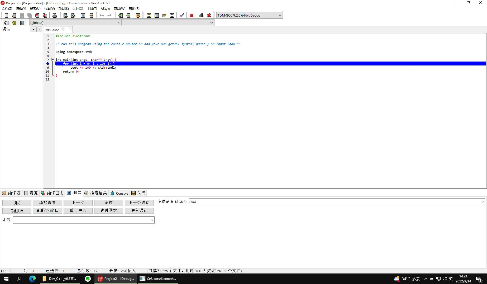
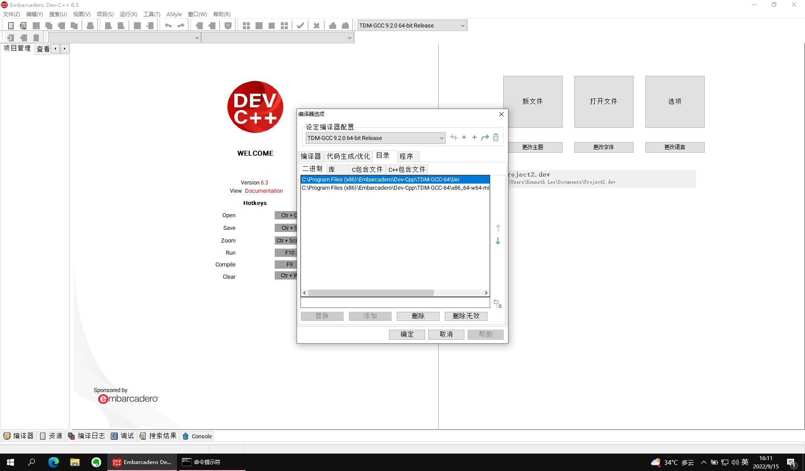
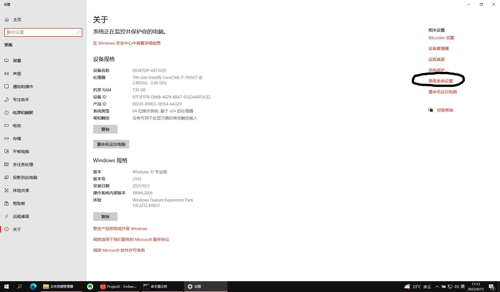
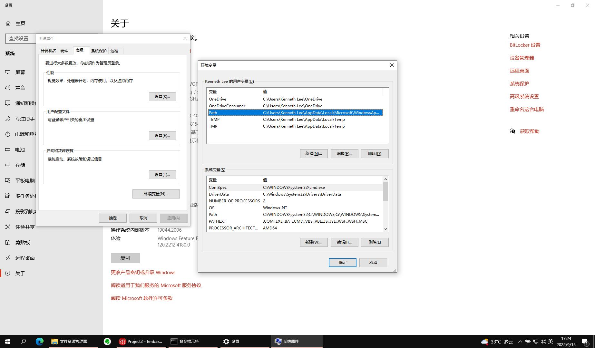

.. Kenneth Lee 版权所有 2022

:Authors: Kenneth Lee
:Version: 0.1
:Date: 2022-09-14
:Status: Draft

IDE环境
*******

Dev C++
=======

好了，我们现在知道你们学校用的环境是Dev C++了。我也来解释一下Dev C++和我们之前
学习的知识是什么关系。

Dev C++是一个IDE，最早是BloodShed公司开发的，后来这个公司不开发了，就开放了源代
码，贡献了出来。所以，这个软件其实是免费的，但国内有些公司组合了一下，直接拿来
卖钱，所以有时你会在网上看到收费的版本，别给钱，找免费的版本就对了（比如这里：
https://devcpp.gitee.io/）。

IDE，是“集成开发环境”的缩写。我一开始建议你不要学用IDE，因为IDE本质上就是把很多
可以自动搞定的事情给你隐藏了。但正如我们一开始说的，它隐藏得越多，你知道得越少，
你能控制的东西也越少。这样你学了半天，你都不知道自己在干什么。但如果要应付考试
呢，你还是要对某个菜单在哪里，某个命令是什么，这些东西很熟悉才行，所以，如果学
校用这个东西做基本环境，最好还是多用用，熟悉些才不会手忙脚乱。

你写了一段时间程序，也知道软件写错了是很常见的现象，特别是DevC++这种老旧的，没
有多少人用，又集成了一堆其他软件的软件，它是有不少问题的，如果你不习惯它的问题
（软件叫Bug），考试会弄半天都没法运行，这很亏。

其实现在国内更流行的IDE是VS Code（这个东西你的Windows上已经安装了），你们学校可
能就是因为懒得升级教材才继续用这个东西。但无论如何，多看一两个环境是什么样的，
也有助于你理解C++这个语言的本质是什么，所以学习一下也没坏。

长期使用，我是建议还是使用前面介绍的Windows的Linux环境比较好，因为那个工具更丰
富，更现代化（比如直接使用git进行版本管理），DevCode太老旧了。等你熟悉Linux的运
行环境，正式写程序的时候，可以根据喜好继续用基本工具，或者直接用VS Code的IDE。

作为开源软件，DevC++用的编译器也是开源的gcc/g++，但它那个环境是基于MinGW的。下
面这个图示意了多种gcc运行环境的区别：

你现在用WSL最大的缺点是不能用图形界面（其实也可以用的，要更多的设置而已，那个我
们先不搞）。还有就是它的根目录是Windows用一个单独的文件模拟的，所以你直接用
Windows的工具访问不了它。不过这个问题现在已经解决了，Windows做了一个特殊处理，
把这个Linux的系统当作一个网络上共享的盘来让你访问了。你可以在Ubuntu的命令行上运
行::

  explorer.exe .

这样会用Windows的文件浏览器打开你当前的Linux目录（explorer.exe是Windows的文件浏
览器，后面那个点是当前目录），这样你喜欢怎么拷贝就可以怎么拷贝了。

当然，你仍可以通过cp命令从Linux中把你目录中的文件拷贝到/mnt/c，从而拷贝到
Windows的C盘上。

但这样一来，你在Windows的一般程序其实是没有办法直接调用Ubuntu里面的gcc的，而这
个用DevC++好处就是不需要WSL，直接就可以当作普通的Windows程序运行。

DevC++运行起来是这样的：

里面那些概念其实你都知道，创建多个.cc，多个.hh，都可以在这个图形界面上看到。但
其实和你一个个打开它们并没有区别。Makefile不需要你写，它会根据你有多少个cc文件，
自动生成这个文件（如果你想知道这个自动生成的Makefile是什么样的，你可以从菜单“运
行-编辑Makefile”打开这个Makefile。但如果你要做更复杂的控制，那你最终还是要自己
写Makefile的。

这里还要理解一个Project的概念，所谓Project，就是我前面讲的“工程”的概念，就是帮
你记住你有多少个文件，每个文件怎么编译，打开这个文件的时候用什么缩进等等。这些
信息记录在一个叫.dev的文件中，但格式是什么样的，就只有这个工具才知道。所以我个
人不是特别喜欢这种IDE环境，因为这样如果我换一个工具，这些内容就都解释不了了。

其他东西你可以一个菜单一个菜单去试，反正概念之前都介绍过。如果你只是写教材中那
些简单的程序，通常你在Project中增加一个个的.cc或者.hh文件，然后敲进去，然后什么
都不管，按F9就是编译，F10就是运行。F2是在当前光标位置设置断点，F5就是开始调试。
简单试一下就可以开始。这种东西很简单，很多老师喜欢拿这个东西教人入门，因为不用
折腾，但这样学习你可能学很久都弄不清楚你的程序是怎么工作的。所以，大部分时间最
好都用WSL（Windows Subsystem for Linux，就是我们前面讲的那种方法）。如果你以后
熟悉这些命令了，我甚至建议不要用Windows，直接用Linux。

VS Code
=======

如果你有兴趣用VS Code，那我们也介绍一下VS Code的基本原理。VS Code不是一个针对
C/C++的IDE，它本质是一个可以写任何代码的编辑器，和你一开始学习的Vim一样。但它提
供了很多插件，你用来写C/C++的时候，它会提供C/C++需要的那些功能（比如编译，调试，
代码自动高亮，自动补全等等），如果你用来写Python，它又会提供Python需要的功能。

作为一个比较现代的工具，VS Code包含很多很新的功能（比如自动分析代码的调用关系，
集成git等等），确实也值得长远使用，特别是如果你以后要分析操作系统，数据库，编译
器这种大型软件的代码的时候，你会发现VS Code会很方便，而Dev C++就全面落后了。

VS Code安装很简单，下载安装包装就是了，它也是免费软件，不需要付钱的。在Windows
上，Linux都能安装。

它的很多功能都由插件提供，但一般你不用专门去装，比如你用它编辑C++文件，要调试，
调试的时候它就建议你装相关的插件的，你到时装就可以了。但有时可能你想装一些你因
为其他原因想用的插件，比如你想用vim的方式编辑文件。那么，你可以通过菜单：查看-
扩展，来打开扩展菜单，然后你就可以通过搜索vim这样那个的关键字找到想要的插件，然
后装上去就可以了。

VS Code没有Project的概念，它的Project就好像我们之前介绍命令行一样，目录就是它的
Project，所以它会要求你打开一个目录，同时，它会问你，是不是这个目录是安全的，然
后它执行的各种动作都在这个目录里面，免得把目录之外的东西弄坏了，所以，你最好创
建一个写你当前程序的目录，然后把所有东西都放在这个目录中，免得东西到处都是。

但VS Code有WorkSpace的概念，这有点类似DevC++的Project，它保存当前的目录，配置信
息，你可以创建一个WorkSpace，它会变成一个.code-workspce文件（这个也是文本文件，
可以直接打开看的），下次你打开这个文件，它也就打开你的目录，然后你设置过的东西
也会留在这里，这会让事情简单一些，但你不用这个功能，每次打开一个目录，其实也没
有任何问题。

对初学者来说，VS Code最大的缺点是它是个编辑器，它是不包含编译器的。就好像vim不
能代替gcc一样，它要求你自己安装gcc，如果你在windows中不能运行gcc，那么VS Code也
无法编译你的程序。

我们可以安装Windows版本的gcc。这有两个办法，一个是安装cygwin，这个东西可以从这
里下载：
`cygwin <http://cygwin.org/setup-x86_64.exe>`_
它是一个类似前面我们介绍的那个MinWG一样的工具（好像它用的就是MinWG，这个我不太
记得了），它把几乎所有的Linux程序，都重新在Windows下编译了一次，包括gcc，你安装
这个东西以后，设置路径就可以让Windows访问它。它也是免费的。

不过cygwin安装要很久，你下下来的只是一个安装器，还不是你要安装的软件，你具体选
装哪些软件，还要你选择从什么服务器装，慢的服务器可能要下载很久，然后才能安装。
我推荐一开始不要用这种办法。

第二种方法是给VS Code装一个MinWG的gcc，这也可以在网上下，也是免费的。

但如果你已经安装了DevC++，那么……刚才我们说了，DevC++其实就装了一个MinWG的gcc，
你可以通过菜单：工具-编译选项，打开编译器的配置，在”目录“一页中，你可以看到你的
MinWG gcc安装在什么地方。你要做的是，把这些位置加入到Windows的PATH变量中。

比如在我的机器上这个配置是这样的：

你把这两个目录拷贝下来，然后打开一个Windows的文件浏览器，在“此电脑”上点鼠标右键，
选择“属性”，然后在打开的窗口中找到“高级系统设置”：

然后选择环境变量，然后编辑里面的Path这个参数，按那里的格式，把前面的目录都加进
去（用分号隔开）。这样，你在任何地方运行gcc，windows都能找到那两个目录中的gcc了。

这个窗口有两个设置，上面窗口中的参数是对你个人的，下面窗口的参数是对所有人的
（用其他名字登录的用户），你喜欢设置哪个都行，我一般这种设置都是只改针对个人的。

这样之后，重启动一下你的VS Code，试试在“命令行窗口”上运行一下gcc这个命令，如果
它不说找不到gcc（但会说你没有输入文件），那现在VS Code能运行gcc了，你的那些插件
应该就可以正常工作了。

无处不在的vi
============

其实，在IDE之外，我个人更推荐用vi，或者严格一点说，我推荐用vim作为基本的编辑
器。这主要有几个原因：

.. note::

   vim叫vi iMproved。最早的时候unix操作系统提供的其中一个基础编辑器就叫vi，提
   供我们今天看到的vim最基本的功能，后来不同的操作系统（特别是Unix系列的操作系
   统）都会提供自己版本，但后来发展得最快的是vim，慢慢我们提vi的时候，就是指
   vim了。比如在Ubuntu下，你运行vi，其实运行的就是vim。无论如何，两者在基础命
   令上基本上一致的。

首先，作为专业程序员，需要一个稳固可靠，适应性强的编辑器。你肯定不会希望到了一
个新的工作环境中，比如在某个客户现场的环境中临时要编辑个什么东西，发现那上面装
不了你的编辑器。而vi是一个适应性最强的编辑器了，图形中可以用gvim，命令行中可以
用vim，看manpage也类似一个只读方式的vi，各种操作系统中都可以装vim。这几乎没有
几个编辑器做得到。我看过不少人用vscode，一旦换一个环境，不是调试配置出问题，就
是make脚本出问题，每次都为环境浪费很多时间。所以，针对某种需要我们可以用一些
IDE，但掌握vim作为基本的工作环境就省很多事。

第二，vim是命令行环境的一部分，这和IDE有微妙的差别，其实会导致很不一样的工作习
惯。IDE自己是个独立的环境，是它在管理命令行，而不是命令行在管理它。什么意思呢？
你运行这个命令，运行那个命令，运行到要编辑个什么文件的时候，用vi进去就写，写完
退出来还是这个命令行，甚至在vim里面你还可以用::

  :!cmd
  :r !cmd
   
这些方式继续运行命令，甚至你直接运行：::

  :grep -Ir "test" .
  :make

这些内置的命令直接调用命令行上的命令，这个过程几乎都是无缝的。很少IDE能做到这
个无缝地在命令和编辑之间无缝的切换，甚至用gvim（vim的图形模式）都会影响这种感
觉。

第三，vim有极高的高度。你努力去学notepad，用得很熟也没用，因为它的功能就那些。
但vim的功能非常丰富，而且可以任意组合，学会一些基本功能后，你需要什么新东西，
都很容易学。

其实vi入门很容易，主要就是克服两点：

1. vim有工作模式的概念。这样同一个按键，在不同的模式下就是不同的功能。比如
   Normal模式下f是查找，但编辑模式下它就是输入f这个字母。所以，和大部分编辑器
   不同，你进入vim后，需要先用i, I, c, C, r, o这些热键进入编辑模式了，才能编辑。
   这有坏处也有好处，坏处是切换模式比较麻烦（特别是有中文的时候）。好处是热键
   多而且好记。

2. 要记住一批标准命令。

所以，联系vim，可以每天训练自己做这个练习，练习不到一个星期就可以形成条件反射
了：

1. vim test.c进入编辑
2. i进入编辑模式，写一个hello world一类的程序
3. esc回到normal模式
4. :wq进入命令模式，存盘并退出。

就先练习这个，慢慢就习惯了。但长期不用呢，就很容易忘，所以之后写一些简单的C,
Python，Makefile等，甚至临时记一个笔记什么的，都用这个写，这样就会形成习惯，哪
怕一个星期就用一次，都不会忘了。

在Normal模式下最重要的是练习一下“快速移动”的技巧。很多人用vim后就再也不能接受
其他编辑器的核心原因就是这个。你在屏幕上看见一个位置，想去修改它，要一步步用箭
头移动过去，这很影响速度。所以，可以记住这样一些键：::

  0 行的最前面
  ^ 行的最前面，除空格
  $ 行的最后面
  /test 向后找到test的位置，然后用n和N重复这个查找的过程（n是正向找，N是反向找，下同）
  ?test 向前找到test的位置，然后用n和N重复这个查找的过程
  H, M, L 移动到屏幕的Highest, Middle，Lowest的位置
  gg 移动到全文最前面(go的重复）
  G 移动到全文的最后面（终极Go）

这就够了，大部分时候这些方法就已经足够你靠近某个位置了，剩下就是用hjkl来移动而
已。

到达位置以后，如果你需要修改，进入修改的方式也值得记住一批命令：::

  x 删除当前位置的字符
  rX 把当前位置的字符换(replace)成X（X可以是任意一个字符）
  C 从当前位置开始，删除本行后面的内容，然后开始编辑(change）
  i 在当前位置前面开始编辑(insert)
  I 在本行最前面开始编辑
  o 在本行后面开一个新行开始编辑
  O 在本行前面开一个新行开始编辑

然后是拷贝和粘贴：::

  v 进入选择模式，之后你可以用任意移动命令去选择（前面学习的移动命令就不吃亏了）
  V 进入行选择模式，这个用于整行拷贝
  y 拷贝
  p 粘贴
  c 在选择好了以后进入编辑模式，并且删除选择好的文字（change）

拷贝这里也有点转折，我们需要认知一下：和其他编辑器不同，vim的拷贝不是拷贝到像
其他编辑器那样，Ctrl-C就拷贝到系统粘贴板，然后你换一个程序Ctrl-V就可以拷贝进去
的。vim拷贝是拷贝到它自己的寄存器0里面的，粘贴是从自己的寄存器0粘贴，所以你用y
在vim中拷贝的东西，在其他程序中用Ctrl-V是粘贴不了的。全系统的粘贴板在vim中的寄
存器是+，如果你要拷贝到这个寄存器，在运行y之前，要先“索引”这个寄存器，先输入"+，
然后再按y，这才是拷贝到系统寄存器，要从系统寄存器粘贴，就要先输入"+，然后按p，
才是拷贝系统寄存器的内容。

这种输入其实挺麻烦的，好处是你有很多的寄存器。你可以用任何字母表示一个寄存器，
比如你拷贝一段代码到a寄存器，你输入"a，然后y，就不会覆盖原来拷贝的内容，如果你
输入"A，然后y呢，拷贝的内容会补充到原来a寄存器的内容中，可以你还可以收集很多拷
贝到a上。这很方便。

在vim中，删除也是一种拷贝，所以你删除了一度文字，它也会拷贝到寄存器0里面，你再
删除，原来的0就会变成1，1会变成2，如此类推，一直到9,所以你删除的历史，至少有9
个可以留下来，你都可以单独拷贝回去。我们经常移动一个函数的位置，就可以先删除它，
然后移动到新的位置，输入p，就可以直接移动到新的位置上了。

学习这些命令，每天练习一下，几个星期，基本上很熟悉了，这就够了。关键是不要变成
死板的一个字符一个字符移动，要变成一眼看去，就能选择一种最快的移动的位置，然后
最快开始编辑的习惯。等你觉得什么地方不方便的时候，就可以再去问人或者上网查一下，
就可以根据需要学习更多的东西，那些反而不重要。vim很多时候不需要是一个可以取代
任何IDE的工具，它首先是一个很趁手的，拿起来就可以用，用起来很快的基础编辑器，
这是我们学习它的根本原因。

好了，现在我们来看为什么vim值得学。

首先，几乎所有好用一点的IDE，都有vim模式。虽然他们没有vim的全部功能，但前面我
们说的，快速移动到一个地方，然后快速根据需要在这个地方进入编辑，这种都是可以提
供的，这样，你之前的练习都不会亏。否则你每学一种新的IDE，都要记一套新的热键，
这很浪费。

然后呢，你如果用man命令来看Linux/Unix的手册，这个东西默认就是vim的模式，你前面
学的东西，都是可以用的。所以这里又不吃亏。

然后呢，如果你运行一个命令，这个命令的内容很多，你看不完，一般你会这样：::

  command | less

这会把command的输出都写到less中，这个less，也是vim的键。

甚至你输入的Linux/Unix的命令行，也是可以是vi的模式的，首先你需要在的HOME目录的
.inputrc中选择这个模式。在这个文件中加上这两句：::

  set edit-mode vi
  set keymap vi

这样你在输入命令的时候，按ESC可以进入normal模式，然后你就可以用前面说过的所有
vim移动和修改命令来编辑整个命令行，甚至，如果你尝试用v开始进入选择，它会直接启
动一个vim，你编辑完了退出，它就直接运行了。

其他的各种Linux/Unix命令，大部分都是有vim模式的，比如窗口管理工具screen和tmux，
邮件处理工具mutt等，所以，学习vim的好处就在这里，你学的不是一个工具，而是一个
标准，是很多工具热键的标准，这样选择这个东西就没有什么亏了。但如果你没有学习过
vim，你就没法体会到这里的必要性，这都是一点点积累出来的。
