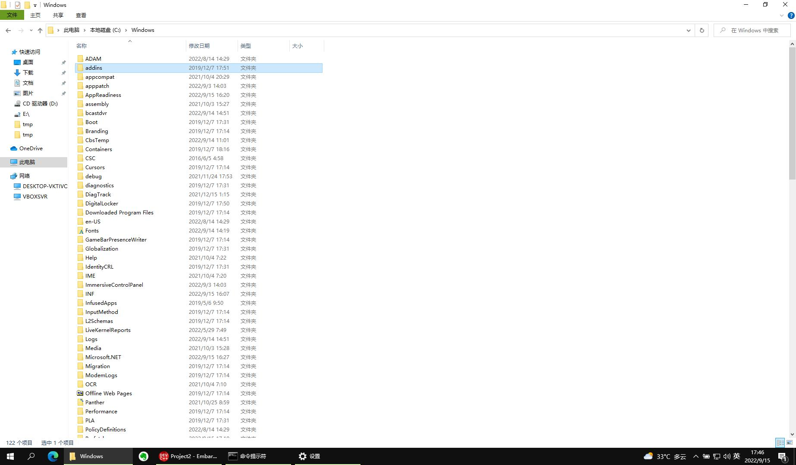

.. Kenneth Lee 版权所有 2022

:Authors: Kenneth Lee
:Version: 0.1
:Date: 2022-09-15
:Status: Draft

:index:`bash`

脚本
*****

介绍
====

从这一章开始，我们开始放飞自我，根据你问什么问题来讲什么问题。

这一章我们来理解一下什么是脚本。

早期的计算机普遍都是命令行的，因为显示一些字符串需要的数据比较少，如果显示复杂
的图形，就需要很多的数据了。

早期的计算机处理能力不强，处理不了那么多数据，所以尽量都是输入字符，输出字符。
所以早期的人机接口都是字符串。甚至早期我们玩的游戏都是字符串的。如果你要删除一
个文件，你运行：::

  rm myfile

这样我们只是传进入十几个字节的字符串，如果计算机没有删除成功，只要给你返回十几
个字节：::

  myfile cannot be deleted

这很容易就搞定了，但如果要显示给你一个这样的窗口：

这个就不是十几个字节的事情了。

所以，计算机人机接口的历史就是从命令行发展过来的。到了现在，这种十几个字节的事
情已经不是问题了，大部分时候，人们不在乎用几百兆的数据去进行人机交互。但命令行
还是很重要的，因为有时我们会遇到很多极端的环境，比如我们需要通过一条卫星通道去
控制我们计算机，那就很难通过卫星给你传递很大的数据了。就算不是卫星，如果我们从
宿舍去控制我们学校机房的计算机，我们也希望越快越好，这时，命令行就很重要了。

所以这就是为什么我一开始先不教你用图形界面，而是用命令行，因为那个是最后的保证，
会命令行你一定能找到方法搞定那个图形界面的，但会图形界面，你不一定能用好命令行。

但省大小不是命令行一直流传下来的关键原因，关键原因是：命令行可以编程序。比如，
你要删除的不是一个文件，你要删除100个文件，你可以这样写这些命令：::

  for file in `ls myfile*.cc`
    if test -e $file
        rm $file

你看，这个和你用C写代码，是一样的。命令行这个好处，是你用图形界面怎么都搞不定的，
图形界面没法自动化，但命令可以自动化：写一个简单的程序就可以了。

正如我们一开始说的，作为一个程序员，我们就很少把重复的事情做很多很多遍了，所有
有可能要重复，写起来很麻烦的事情，我们就都写成脚本。这样有两个好处：

1. 下次运行什么都不用记了，直接运行脚本就可以了。
2. 脚本本身变成了一个笔记，要查笔记看脚本就行了。

我举个例子，假设你每次编译完你的程序，你都要拷贝到windows的目录下，你每次都要运
行这些命令：::

  cp myapp /mnt/c/用户/qing/编译好的应用程序/
  cp myapp2 /mnt/c/用户/qing/编译好的应用程序/
  cp myapp3 /mnt/c/用户/qing/编译好的应用程序/

那么你就可以打开一个文本文件（比如就叫cp.sh)，把这些命令都写进去，然后你每次要
做这些动作的时候，直接运行：::

  sh cp.sh

（sh是一个shell，我们用这个shell去运行cp.sh这个“脚本”。）

就可以了。这个cp.sh，就是一个“脚本”。以后如果你不记得你文件都放在哪里了，打开这
个文件也可以知道了，就不会出现不记得的情况。

学习脚本首先要学习命令，我上次给你那本大部头，你要对着操作一次，才知道这些命令。
多用几次就会记住怎么用了。至于生癖的命令，可以到用的时候再去查。

那些for啊，if啊，其实也是命令，这些都需要学。那个我这里讲不完，你要自己去用才知
道。

我这里只给你一个Cheatsheet：::

  ls                     # 列出当前目录下的文件
  ls -l                  # 用long的方式列出当前目录的文件和它们的属性
  cp file1 path          # 把file1拷贝到路径path
  cp -a path1 path2      # 把path1中的所有文件拷贝到path2中
  cp file1 path/file2    # 把file1拷贝到path中，名字改成叫file2
  rm -Rf path1           # 删除path1中的全部文件
  rm file1 file2 file3   # 删除文件file1, file2, file3
  mv file1 file2         # 把file改名叫file2
  mv file1 file2 path    # 把file1和file2移动到path目录中
  mkdir path             # 创建一个叫path的目录
  cd path                # 当前目录移动到path
  cd ..                  # 移动到当前目录的上一级目录
  sh file                # 用sh（就简单的shell）运行file这个脚本
  . file                 # 用当前shell运行file这个脚本
  exit                   # 退出当前shell
  adduser qing           # 添加用户qing
  deluser qing           # 删除用户qing
  passwd qing            # 修改qing的密码
  passwd                 # 修改当前用户的密码
  chmod +x file          # 让file变得可执行
  chmod -x file          # 让file变得不可执行
  chmod o-x file         # 让file对于other的人不能执行
  chmod u+x file         # 让file对于file的所有人可以执行
  man ls                 # 看ls的手册
  man -k user            # 查找有哪些包含user这个关键字的的手册名字，如果你隐约记得有一个命令，但记不住确切的名字，可以用这个方法找

其他的等你问我再补充吧。

在Unix世界中，和你交互的那个界面，叫一个shell，表示它是操作系统的“外壳”，shell
有很多种，图形界面也是一种shell。最传统的shell叫sh，功能很简单，我们平时用得比
较多的，是bash，你的Windows上的ubuntu默认就是这个Shell。其他的还有csh，tsh等各
种shell。windows也有自己的命令行的PowerShell，它们每个语法都不同，我建议你先从
bash shell入门。其他的shell基本语法很接近，只是高级语法不同。反正所有计算机语言
都是这样，先学一种语言，需要的时候再学一种新的，多学几种以后，大部分套路就都知
道了。

脚本也可以像命令一样运行。这有两个条件：

1. 在脚本最前面加上这一句：::

      #!/bin/bash

   这是为了保证操作系统知道你要用哪个shell去执行你的脚本

2. 用chmod +x命令把这个文件修改成可执行的。

这样以后，你的脚本就可以用这种办法运行了：::

  ./my_script.sh

路径是必须的，因为Linux和Windows不同，Linux不认“当前目录的可执行文件"的，你运行
一个命令，如果不在PATH这个环境变量中声明路径，它是不会找当前路径的。

上一章我们为了让你的VS Code找到gcc的安装位置，我们就修改了Windows的Path环境变量
了。

那到底什么是环境变量呢？

还记得我们之前说过的“库函数”吗？你调用cout >> "Hello world"，调用的就是库里面的
函数，假设，我们的cout库支持打印不同的颜色，但你这个调用没有指明颜色，我们有什
么办法让这个库知道你要显示什么颜色呢？

为了解决这个问题，Shell通过操作系统给你的程序的内存里面放了一组预定的变量，比如
可能是这样的：::

  PATH=/bin;/sbin;/usr/bin
  COUT_COLOR=RED
  LC_ALL=zh_CN.GB18030
  ...

这样，你这个cout的库可以从约定的位置读一下，就可以获得这种参数了。在bash shell
中，你运行env，就可以找到所有的环境变量，你可以运行export COUT_COLOR=BLUE这样设
置新的变量，如果你要固定设置下来，就可以好像修改.vimrc那样，把这句话写到.bashrc
中。

我们运行命令的时候，可以动态修改一个命令的环境的，比如你可以试试分别运行下面两
个命令：::

  LC_ALL=zh_CN.GB18030 date
  LC_ALL=C date

LC_ALL是个环境变量表示当前的语言，第一个命令表示现在是中文，所以date输出的就是
中文，而第二个说用的是通用语言（这个C我也不知道是不是表示C语言），这样输出就是
英文的。

当你运行一个Linux的命令，如果你写了路径，Shell就会从路径去找到这个文件来运行，
但如果你没有写路径，Shell从PATH变量写的路径里找这个命令，如果找不到，那就是没有
了，通常当前目录，是不写在PATH中的，你当然可以强行写进去，比如这样：::

  export PATH=.;/bin;/sbin;/usr/bin
  my_script.sh

这样，如果你的my_script.sh在当前目录下，shell也是能找到的。但我建议你不要这样做，
因为这是一个被证明的不安全的习惯。等你未来学计算机安全的时候，我们再来讨论这个
话题吧。

bash例子
========

本章我们通过例子来学习一些脚本知识。例子的好处是它相当于切开一个问题的剖面，把
很多知识连起来。我们可以通过这些例子了解到一些没想到的理念，没有接触过的命令，
或者没考虑到的解决问题的方法。

我们用bash做例子，一方面是bash的使用很广泛，学习bash可以直接用，另一方面它兼容
sh，而sh是POSIX标准，所以很多基本原理都是和很多其他Shell是相通的。可以认为它代
表了Unix看待问题的方法。现在有些Shell，比如微软的Power Shell，趋向于走另一个理
念方向，它们会更接近Python这样的编程语言。这里核心的区别在于：传统的Unix Shell
的理念是基于字符串的。而Power Shell是基于数据结构的。我认为这是两者最大的区别。

我们用Python来举例，在Python中，你也可以调用命令的，比如我们在bash上运行命令ls，
我们看到它有结果：::

    kenny@linux-desktop:~/work/cpp_aux_tutorial (main *)$ ls
    01.rst  03.rst  05.rst  07.rst  09.rst  11.rst  13.rst  15.rst  _build  conf.py      index.rst  Makefile  _templates
    02.rst  04.rst  06.rst  08.rst  10.rst  12.rst  14.rst  16.rst  codes   _extensions  LICENSE    _static

用python你也能做一样的事情，我们启动python，在它的命令行上运行：::

  >>> import os
  >>> os.system('ls')
  01.rst  03.rst  05.rst  07.rst  09.rst  11.rst  13.rst  15.rst  _build  conf.py      index.rst  Makefile  _templates
  02.rst  04.rst  06.rst  08.rst  10.rst  12.rst  14.rst  16.rst  codes   _extensions  LICENSE    _static

这种情况下python也是一个shell，它也可以运行命令，处理命令。

你更愿意用前一个还是后一个呢？其实后一个更灵活，它可以使用各种函数，调用加减乘
除，数组，向量等各种算法。但如果日常使用，其实我们更愿意使用第一个，因为第一个
敲的东西少啊。

我认为这就是bash这种shell和Python这种shell的核心区别，bash几乎没有复杂的数据结
构的，它的所有数据结构都是字符串，命令也是字符串，输入输出也是字符串，你看见什
么就是什么，这样，你知道命令输出什么就够了，根本不用懂具体的数据结构，这样学习
成本就很低，所以，简单的自动化工作，用这种shell就是最方便的，复杂的时候，我们
才会用Python类的Shell来写程序。在Python这种shell里面，你一眼看过去，都不知道
os.system('ls')的输出是ls这个命令输出的，还是os.system()的返回值，你要学。bash
没有这个问题，bash是你看见了，就是可以处理的。所以，在bash中，你要循环，就是这
样的：::

  for i in `ls`; do 
        echo 找到了 $i
  done

这个循环直接用ls的输出作为循环序列（bash自动用空格当分割符，这是可以改的，我们
遇到再说），然后一行行输出“找到了xxx文件”。如果你要用Python写这样的东西，就要
这样写：::

  for i in os.popen("ls").split():
        print('找到了', i)

后面这个你首先得懂popen（这里用system不行，因为system没有返回值），知道它可以
返回一个ls输出的字符串，然后你还要知道字符串有split()函数可以分割空格。

bash的这些特点，可以从后面的例子中慢慢体会。

例1：切割图片
-------------

假定我们现在需要分割一个图片，把它转成NxM的多个小图片，我们已经查到了，
ImageMagick的convert命令可以完成这个工作，比如我们有一个200x200的图片叫
full.jpg，我们要分成平均切成4份，那么命令上我们可以这样：::

  convert -extract 100x100+0+0     -i full.jpg p1.jpg
  convert -extract 100x100+100+0   -i full.jpg p2.jpg
  convert -extract 100x100+0+100   -i full.jpg p3.jpg
  convert -extract 100x100+100+100 -i full.jpg p4.jpg

这写成脚本，直接放在一个extract.sh中，你可以这样写：::

  #!/bin/bash

  convert -extract 100x100+0+0     -i full.jpg p1.jpg
  convert -extract 100x100+100+0   -i full.jpg p2.jpg
  convert -extract 100x100+0+100   -i full.jpg p3.jpg
  convert -extract 100x100+100+100 -i full.jpg p4.jpg

这是这个脚本最简单的写法，虽然用于，但至少你不用每次输错了还要改半天，改这个文
件就行了。所以，在Unix下工作，基本上我们都用脚本，否则效率太低。其实这个工作，
你直接用gimp手工一个个截图也行啊，但你应该也感觉到了，这没有命令行方便。

现在我们消除那些重复的东西，我们引入变量：::

  #!/bin/bash

  CMD="convert -extract"
  SOURCE_IMG=full.jpg

  $CMD 100x100+0+0     -i $SOURCE_IMG p1.jpg
  $CMD 100x100+100+0   -i $SOURCE_IMG p2.jpg
  $CMD 100x100+0+100   -i $SOURCE_IMG p3.jpg
  $CMD 100x100+100+100 -i $SOURCE_IMG p4.jpg

bash的变量很简单，就是xxx=yyy这样就可以了，但要注意，等号前后不能有空格。我们
前面说过了，bash的所有处理都是字符串，你加个空格，它以为你就是要运行CMD这个命
令呢，写bash程序，对于字符串怎么断开的，一定要非常敏感。这也是

使用变量就加个$在前面就可以了，这个在例子中我们已经看到了。

现在解决第二个问题：能不能换一个图片，不要每次都要修改脚本？这就涉及到命令行输
入的问题了。bash有一些内置的变量，就是$0, $1, $2……这样的，表示命令行参数。比如
你这样运行你的程序：::

  ./extract.sh full.jpg p

那么，你的$0就是./extract.sh，$1就是full.jpg, $2就是p。这样，我们的程序就可以
写成这样了：::

  #!/bin/bash

  CMD="convert -extract"

  $CMD 100x100+0+0     $1 $2-1.jpg
  $CMD 100x100+100+0   $1 $2-2.jpg
  $CMD 100x100+0+100   $1 $2-3.jpg
  $CMD 100x100+100+100 $1 $2-4.jpg

不过这样，如果你没有输入参数怎么办呢？那你的命令就会变成这样：::

  convert -extract 100x100+0+0 -i -2.jpg

因为$1和$2都没有了，所以，一般我们会做一个检查：::

  if [ -z "$1" ]; then
        echo "没有输入文件名"
        exit -1
  fi

  if [ -z "$2" ]; then
        echo "没有输出文件名前缀"
        exit -1
  fi

这里很有趣的地方是：[其实也是命令，if其实在判断[这个命令的返回值（所以后面要加
空格。而且bash中，返回值0表示true，其他值表示false）。 而-z用来检查后面的字符
串是不是空。所以，我们可以两个判断组合在一起，这样：::

  if [ -z "$1" -o -z "$2" ]; then
        echo "用法：$0 输入文件 输出前缀
        exit -1
  fi

其中的-o表示or。同理-a表示and。

还要注意的是，这里的双引号不能省略也不能换成单引号。如果省略，这句话就变成：::

  if [ -z -o -z ]; then

了，这样-z就没有参数了。如果换成单引号，单引号的作用是不让解释变量，所以你得到
的是：::

  if [ -z $1 -o -z $2 ]; then

而不是：::

  if [ -z full.jpg -z p ]; then

所以，也是不对的。

好，现在我们走一步大的，我们想更简单一点，最好可以这样运行命令：::

  ./extract.sh full.jpg p 4x4

这样我们可以自动完成所有的循环。为此，我们需要知道图片的大小，我们知道
ImageMagick里面的identify命令可以看图片信息，我们可以看看它的manpage，
知道可以这样获得一个图的大小：::

  kenny@desktop> identify full.jpg
  full.jpg JPEG 640x480 640x480+0+0 8-bit sRGB 68625B 0.000u 0:00.000

这里第三个单词就是它的大小，Linux有一个命令（awk）可以按空格分离第几项的，我们
可以这样：::

  kenny@desktop> identify full.jpg | awk '{print $3}'
  640x480

  kenny@desktop> identify full.jpg | awk '{print $3}' | awk -Fx '{print $1}
  640

  kenny@desktop> identify full.jpg | awk '{print $3}' | awk -Fx '{print $2}
  480

首先是这个"|"管道操作符，它把identify的输出作为awk的输入，awk后面是一个脚本，
输出第三项，就得到640x480，然后我们再用x作为分隔符，输出第一和第二项，就得到具
体的图片的宽和高了。现在我们可以通过这个命令来求图片的原始长度了：::

  SIZE=`identify $1 | awk '{print $3}'`
  WIDTH=`echo $SIZE | awk -Fx '{print $1}'`
  HEIGHT=`echo $SIZE | awk -Fx '{print $2}'`

其中这个反引号``表示把命令打印的东西全部当作变量的内容。这里我们先求SIZE，就是
那个640x480，然后我们再把它拆开成640和480，得到宽和高。

一样的方法我们可以拆开那个4x4：::

  N=`echo $3 | awk -Fx '{print $1}'`
  M=`echo $3 | awk -Fx '{print $2}'`

剩下的问题是怎么算小图的长和宽了，我们说过，bash只有字符串，没有其他类型，所以，
$WIDTH，$HEIGHT这些值虽然看起来是个数字，其实是个字符串。要做计算，要不传给一
个命令，比如bc：::

  kenny@desktop> echo 10+10 | bc
  20
  
要不用bash的内置方法：::

  VALUE=$((10+10))

我们选后者，现在整个程序就可以这样写了：::

  #!/bin/bash
  set -e
  
  if [ -z "$1" -o -z "$2" -o -z "$3" ]; then
  	echo "用法：$0 输入 输出前缀 分解要求"
  	exit -1
  fi
  
  SIZE=`identify $1 | awk '{print $3}'`
  WIDTH=`echo $SIZE | awk -Fx '{print $1}'`
  HEIGHT=`echo $SIZE | awk -Fx '{print $2}'`
  N=`echo $3 | awk -Fx '{print $1}'`
  M=`echo $3 | awk -Fx '{print $2}'`
  W1=$(($WIDTH/$N))
  H1=$(($HEIGHT/$M))
  
  for w in `seq 0 $(($N-1))`; do
  	for h in `seq 0 $(($M-1))`; do
  		SPEC=${W1}x${H1}+$(($w*$W1))+$(($h*$H1))
  		echo "extract $SPEC"
  		convert -extract $SPEC $1 $2-$w-$h.jpg
  	done
  done

现在我们把这个脚本写在文本文件中（比如叫extract.sh），chmod +x extrace.sh，然
后运行：::

  ./extrace.sh myfile.jpg p 3x2

就可以得到需要的分割了。
