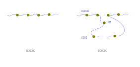
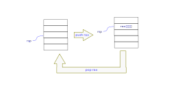

.. Kenneth Lee 版权所有 2024

:Authors: Kenneth Lee
:Version: 0.1
:Date: 2024-01-29
:Status: Draft

理解调度器
**********

调度器和切换
============

这一章，我们为做操作系统做准备，了解一下，到底什么是调度器。

我们已经知道，我们的计算机的计算中心是CPU，我们也看了汇编的样子了，知道CPU就是
一条指令一条指令去执行要求的功能。

现在我们需要考虑一下：我们平时用操作系统，开了很多个应用程序，但我们只有一个
CPU（现代的计算机会有更多，但也没有你开的应用多，那么，这些应用怎么分享这个或
者这些CPU呢？）

在最早的时候，计算机主要用来做科学计算，你写好了算法，跑去计算机中心，计算机管
理员给你排个队，等前面的人算完了，就放你的程序，到时告诉你结果就行了。

这叫批处理系统。负责调用完一个程序再调用下一个程序的方法，就叫这种批处理系统的
的“调度器”。大抵这个调度器就是跑完一个程序，然后去查一个列表，看看谁的优先级高，
高的那一个先跑。

我为这个章节写了一个示例，叫sched_tutor，工程在这里：
`sche_tutor <https://gitee.com/Kenneth-Lee-2012/sche_tutor>`_\ 。
其中的batch_sched.c就是一个批处理调度器的例子。我这里把所有的job都放在一个程序
中了，换成每个人写一个程序，其实也不过是多了把代码加载到内存不同位置的过程。原
理是一样的。

批处理调度在计算机很贵，各个研究机构为了一个计算还要专门跑到计算机中心去一趟的
时代可以，在现在这个时代肯定是不行的。就算到了后来，每个计算工程师分配一个“终
端”，大家都可以操作计算机的时代，它也是不行的，因为至少CPU还要时时刻刻来看看每
个终端有没有新的任务拿进来要求执行。

这种情况我们需要更灵活的调度器。我写第二个调度器给你看。就是sched_tutor中的
cothread_sched.c。我们通过这个例子来看看，多个任务是怎么分享同一个CPU的。

在这个例子中，我们和前面一样，还是支持三个job，也是都在做循环。但在循环的中间，
我们加入了几个yield函数，相当于调用了一下操作系统，让操作系统拥有一个“调度”的
机会，然后CPU就可以在循环的中间，从一个job跳到另一个job去执行。这样，这几个job
就可以“分时”使用这个CPU了。每次这个任务执行到yield的时候，操作系统就可以根据一
定的策略，决定选择哪个job运行，这也是一个调度。比如它可以按优先级调度，哪个job
的优先级高，就先调度它，它也可以按时间，谁运行的时间最少，就先运行谁。

这种调度叫做“协助式调度”，早期的Windows（比如Windows1.0），就是这样调度了，每
个job都要主动让出CPU，让操作系统调度下一个job进来运行。后来技术发展了以后，可
以不用job自己去调用yield了。而是通过时钟中断来解决这个问题。

所谓中断，是一种异步指令流。我们说过，CPU是按着指令的序列一条条指令执行下去的。
但如果这时有一些突发事件需要处理怎么办呢？那可以在某条指令后面人为插入一个调用，
调用完还是回到原处继续执行下去：

这样，我们就可以在CPU外面部署一个时钟，每隔一段时间（比如50ms），就产生一个中
断，这样就可以强行抢走job的控制权，让它回到操作系统的控制中，和主动调用一个
Yield函数其实没有本质区别。我们能看到这个Yield函数的原理，就也能看懂中断方式的
调度是什么样的。

在我们这个例子中，我们的Yield函数就是一个sched调度函数，它怎么选择下一个执行的
job的我们不细说，我们重点关注它怎么从一个job跳到另一个job的。在这之前，我们首
先理解一下函数调用的堆栈使用原理。

在\ :doc:`13`\ 中我们介绍过x86_64汇编是怎么工作的，但我们没有细说函数调用的接
口。在x86_64的汇编中，堆栈用push和pop实现，堆栈指针是rsp寄存器。push把rsp减8
（8个字节，正好一个寄存器的大小），然后把数据存进去；pop读出数据，然后把rsp减8，
这样就形成一个堆栈的操作了。

调用和返回是个综合了push/pop的跳转操作，其中call跳转到指定的地址上，同时push返
回地址，而ret pop返回地址，然后跳转回pop的地址上。所以，Yield的原理就很简单了，
如果我要从job1转到job2，那么我只要把当前CPU的寄存器全部保存起来，然后把之前保
存的job2的寄存器都恢复到CPU上，对job2来说，就好像CPU一直在执行自己一样了。

想像一下，job1执行了一步，然后Yield到job2，然后job2也执行了一步，Yield回job1，
job1只会觉得现在是Yield函数返回了，从来不觉得job2被执行过啊。这样一来，每个job
都会觉得自己独占了CPU，但其实在调度器（OS）的眼中，其实是所有的job分享了CPU，
至于分享多少时间的CPU，就都在OS决定怎么调度了。

这里还有一个关键破绽：堆栈。我们考虑一下如下代码：

.. code:: C

  void c() {
        yield();
  }
  void b() {
        c();
  }
  void a() {
        b();
  }

这个代码a调用了b，堆栈中有a里的返回地址，然后b又调用了c，c在调用yeild的时候，
堆栈是这样的：

如果我切换到另一个job，那个job正好就在函数返回，那么它就会返回到原来那个job的c
函数上了。这不合理，我必须让它返回到新的job的返回地址上。所以，你现在发现了，
我们不但需要切换所有的寄存器，我们还需要切换堆栈。综合一下，就可以明白整个切换
程序怎么写的了：::

  switch_to:
  	// 保存前一个任务的TCB
  	test %rdi, %rdi                // 检查rdi的值是否为0
  	je 1f                          // rdi为0不用保存，跳到后面1的位置
  	mov %rsp, 0(%rdi)              // 先保存堆栈指针，马上要用
  	lea 8*17(%rdi), %rsp           // 堆栈指针移到TCB rflags的位置
  	pushfq                         // 保存rflags
  	push %r15                      // 保存剩余的寄存器
  	push %r14
        ...
  	push %rbx
  	push %rax
  
  1:    lea 8(%rsi), %rsp             // 堆栈指针移动到TCB rax的位置
  	pop %rax                      // 恢复所有寄存器
  	pop %rbx
        ...
  	pop %r14
  	pop %r15
  	popfq
  
  	// 现在rdi是当时切换的TCB
  	mov 0(%rdi), %rsp              // 恢复堆栈
  	ret                            // 当时的堆栈中有返回地址，直接ret

说到底，所谓的切换，也就是更换CPU的寄存器和job的堆栈而已。 

所有操作系统有关的概念，比如你要休眠3秒，调用sleep(3)，这个函数里面其实也是
yield的实现，只是在你的job里面加上一个标记：3秒内不要调度它。或者你要控制一个
机器人，OS给机器人发一个信号，然后在机器人没有响应控制完成前，先去调度其他job。
所有这些行为，对操作系统来说，都是个调度行为。

内存调度
========

我们再介绍一下操作系统是怎么调度内存的。我们前面的cothread_sched里面给给每个
job分配堆栈和TCB，就是一种内存调度算法：我们知道我们有一大片连续的内存（比如你
买了16GB的内存，这些内存可能就会被编址在1000到16G+1000的位置上，你顺序一个个放
下去就可以保证这些job不会冲突了。如果要动态malloc/free或者new/delete，也不难做
到。

但关键是怎么保证不同的job不能把别人的内存修改了。早期的解决方案是每次切换到一
个新的job的时候，都更新一个寄存器（这种寄存器叫系统寄存器），CPU在指令访问内存
的时候，根据这个寄存器判断一下这个地址是否在某个范围内，如果在这个范围内，访问
就可以成功，否则当作发生一次中断（这种CPU执行指令时发现错误而中断执行的行为叫
“异常”），调用回操作系统里面就可以了（操作系统可以回收这个job的内存，从此不调
度它就行了）。

上面这种控制内存的方法叫做段式管理。因为通常你给job1一片内存（比如0x12340000到
0x12350000），都是指定一个开始地址加一个长度，这样叫一个“段”。这种方法很原始，
因为一个段就必须连续，但job很难一开始就决定要多少内存，给多了浪费，给少了，后
面的部分可能分给其他job了。缓解的方法就是允许多几个段，但终究还是不灵活。

所以后来就发展了新的技术，叫“页”，“页”的方式就是不再指定一个个段了。而是定义一
组固定大小的段（这样的段就叫页了，因为它像书本一样，每页都一样大）。但这么多页
的说明又放哪里呢？——当然就只能放在内存里面了。这个内存里面说明页在哪里的数据结
构，就叫“页表”，页表说明CPU发出的地址实际是真实的地址的什么位置。

这样一来，mov (%eax), %ebx中eax指定的地址就不是真正的地址了，而是一个要经过翻
译的地址。为了区分，CPU把没有经过翻译的地址叫“虚拟地址”（VA），而真正的地址叫
“物理地址”（PA），这样OS给不同的job分配的内存，就可以被通过VA映射到不同的PA上，
它们就永远都访问不到对方的PA了。

那么OS自己呢？OS自己也用VA，只是OS自己的页表是可以映射到所有PA的（实际操作中甚
至让PA等于VA，或者PA等于VA+offset），这样OS自己可以分配好内存，然后切换到不同
的job上，就切换一下页表，让那个job只能访问OS给它分配的内存就行了。

所以我们对job就有了两个概念：线程和进程。如果job使用的是相同的物理地址空间，那
么它们就可以互相影响，这就叫线程。如果job使用是不同的物理地址空间，那么它们就
互相独立，这就叫进程。我们前面的batch_sched和cothread_sched都是OS中的一个进程，
我们这个进程里面实现了自己的线程。OS当然也提供它原生的线程支持（参考pthread的
手册）。

在Linux或者WSL上，我们都可以直接通过/proc文件系统看到每个进程的内存分情况。比
如我们ps -ef可以看现在系统中跑了多少各进程，以及这些进程的进程IP：::

  kenny      13878    3272  0 14:03 pts/4    00:00:00 -bash
  root       13969       2  0 14:04 ?        00:00:00 [kworker/13:1]
  kenny      16206    3272  0 14:17 pts/5    00:00:00 -bash
  kenny      17101   12073  0 14:22 pts/2    00:00:10 vi 18.rst

其中第一个bash进程的pid是13878，我们到/proc/13878中就可以看到它的信息：::

  arch_status  cmdline             environ  ksm_merging_pages  mem         numa_maps      personality  setgroups     status          uid_map
  attr         comm                exe      ksm_stat           mountinfo   oom_adj        projid_map   smaps         syscall         wchan
  autogroup    coredump_filter     fd       limits             mounts      oom_score      root         smaps_rollup  task
  auxv         cpu_resctrl_groups  fdinfo   loginuid           mountstats  oom_score_adj  sched        stack         timens_offsets
  cgroup       cpuset              gid_map  map_files          net         pagemap        schedstat    stat          timers
  clear_refs   cwd                 io       maps               ns          patch_state    sessionid    statm         timerslack_ns

其中的maps就是它的虚拟地址空间：::

  5587d414a000-5587d4179000 r--p 00000000 103:02 9175265                   /usr/bin/bash
  5587d4179000-5587d423a000 r-xp 0002f000 103:02 9175265                   /usr/bin/bash
  5587d423a000-5587d4272000 r--p 000f0000 103:02 9175265                   /usr/bin/bash
  5587d4272000-5587d4276000 r--p 00128000 103:02 9175265                   /usr/bin/bash
  5587d4276000-5587d427f000 rw-p 0012c000 103:02 9175265                   /usr/bin/bash
  5587d427f000-5587d428a000 rw-p 00000000 00:00 0
  5587d5dc9000-5587d5f6e000 rw-p 00000000 00:00 0                          [heap]
  7efd26e00000-7efd2788c000 r--p 00000000 103:02 9194970                   /usr/lib/locale/locale-archive
  7efd278d4000-7efd278d7000 rw-p 00000000 00:00 0
  7efd278d7000-7efd278fd000 r--p 00000000 103:02 9175868                   /usr/lib/x86_64-linux-gnu/libc.so.6
  7efd278fd000-7efd27a52000 r-xp 00026000 103:02 9175868                   /usr/lib/x86_64-linux-gnu/libc.so.6
  7efd27a52000-7efd27aa5000 r--p 0017b000 103:02 9175868                   /usr/lib/x86_64-linux-gnu/libc.so.6
  7efd27aa5000-7efd27aa9000 r--p 001ce000 103:02 9175868                   /usr/lib/x86_64-linux-gnu/libc.so.6
  7efd27aa9000-7efd27aab000 rw-p 001d2000 103:02 9175868                   /usr/lib/x86_64-linux-gnu/libc.so.6
  7efd27aab000-7efd27ab8000 rw-p 00000000 00:00 0
  7efd27ab8000-7efd27ac7000 r--p 00000000 103:02 9177548                   /usr/lib/x86_64-linux-gnu/libtinfo.so.6.4
  7efd27ac7000-7efd27ad8000 r-xp 0000f000 103:02 9177548                   /usr/lib/x86_64-linux-gnu/libtinfo.so.6.4
  7efd27ad8000-7efd27ae6000 r--p 00020000 103:02 9177548                   /usr/lib/x86_64-linux-gnu/libtinfo.so.6.4
  7efd27ae6000-7efd27aea000 r--p 0002d000 103:02 9177548                   /usr/lib/x86_64-linux-gnu/libtinfo.so.6.4
  7efd27aea000-7efd27aeb000 rw-p 00031000 103:02 9177548                   /usr/lib/x86_64-linux-gnu/libtinfo.so.6.4
  7efd27b08000-7efd27b0f000 r--s 00000000 103:02 9190023                   /usr/lib/x86_64-linux-gnu/gconv/gconv-modules.cache
  7efd27b0f000-7efd27b11000 rw-p 00000000 00:00 0
  7efd27b11000-7efd27b12000 r--p 00000000 103:02 9175865                   /usr/lib/x86_64-linux-gnu/ld-linux-x86-64.so.2
  7efd27b12000-7efd27b37000 r-xp 00001000 103:02 9175865                   /usr/lib/x86_64-linux-gnu/ld-linux-x86-64.so.2
  7efd27b37000-7efd27b41000 r--p 00026000 103:02 9175865                   /usr/lib/x86_64-linux-gnu/ld-linux-x86-64.so.2
  7efd27b41000-7efd27b43000 r--p 00030000 103:02 9175865                   /usr/lib/x86_64-linux-gnu/ld-linux-x86-64.so.2
  7efd27b43000-7efd27b45000 rw-p 00032000 103:02 9175865                   /usr/lib/x86_64-linux-gnu/ld-linux-x86-64.so.2
  7fff8436a000-7fff8438b000 rw-p 00000000 00:00 0                          [stack]
  7fff843d9000-7fff843dd000 r--p 00000000 00:00 0                          [vvar]
  7fff843dd000-7fff843df000 r-xp 00000000 00:00 0                          [vdso]

你可以看到这个程序的代码，数据还有堆[heap]，堆栈[stack]分别放在虚拟地址的什么
位置。

然后你可以再找一个不同进程看看，就会发现它们是重合的。原因我们也解释过了：这些
都是虚拟地址，真正的物理地址每页都会映射到不同的物理地址位置（现在默认每页的大
小是4KB）。

锁
==

我们再解释一下什么是锁。比如你有两个线程，都用同一个内存记录学生成绩，那么其中
一个线程在更新内存的内容的时候，另一个线程如果也去更新，那这个数据就可能乱了。
所以，其中一个线程去更新这个记录的时候，另一个线程就不能更新。所以，某个线程去
访问这片内存的时候，调用一个lock，然后访问，访问完调用unlock。这相当于一个洗手
间，谁进去就锁门，其他人就只能在门口等，等他出来了就开锁，下一个人就可以进去了。

锁具体怎么实现呢？它本质还是一个yield。调用lock的job进去的时候发现锁的状态是未
锁，就设置一个状态，然后继续调度就行，如果进去的时候发现状态是上锁，那就
switch_to到其他线程就行了。

这是单CPU的故事，如果你的平台有多个CPU会怎么样的？其实没有区别的，每个CPU都有
一组自己的job要调度，互相之间是没有冲突的，如果遇到两个CPU的job一起访问同一把
锁，只要保证判断锁的状态的行为是原子的，上面的逻辑还是成立的。

锁算法主要解决的是死锁一类的问题，比如有些线程会申请两把锁，它先锁A，再锁B，然
后才开始干活，但另一个线程可以先锁B，再锁A，才开始干活。这样一旦出现第一个线程
锁了A，第二个线程锁了B，然后两个线程都会等待对方解锁才能继续，这样就变成互相的
都干不成活的情况了。

小结
====

操作系统学习的是各种资源，比如CPU，内存，磁盘，设备等设备的调度方法。但我们首
先要理解这种调度本身是什么样的，才能正确认识这些调度算法。希望本章的介绍，可以
让你理解这种调度在实际中呈现成什么样子。
